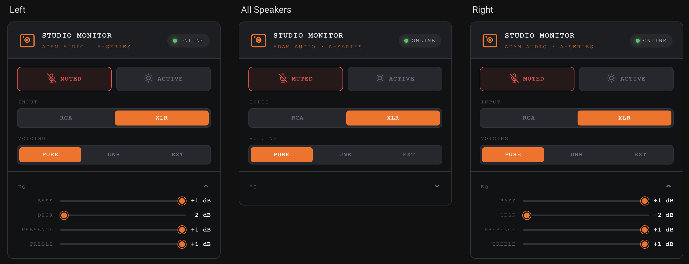

# hass-adam-audio-control

[](https://github.com/hacs/integration)
[](https://www.home-assistant.io)

Home Assistant integration for **ADAM Audio A-Series studio monitors** (A4V, A7V, etc.) via the AES70/OCA protocol over UDP.

Controls each speaker individually and provides a virtual **All Speakers** group device to control both monitors simultaneously from a single entity or dashboard card.

---

## Features

| Control | Entity Type | Notes |
|---|---|---|
| Mute / Unmute | `switch` | |
| Sleep / Wake | `switch` | Standby mode |
| Input Source | `select` | RCA or XLR |
| Voicing | `select` | Pure, UNR, Ext |
| Volume | `number` | −12 to +12 dB, 0.5 dB steps |
| Bass | `number` | −2 to +1 dB |
| Desk | `number` | −2 to 0 dB |
| Presence | `number` | −1 to +1 dB |
| Treble | `number` | −1 to +1 dB |

Auto-discovery via **mDNS** (`_oca._udp.local.`) with **manual IP fallback**.

---

## Screenshots


*Integration page showing 3 devices (Left, Right, All Speakers) and 24 entities*


*Per-device control panel — EQ, input source, voicing, mute and sleep*


*All entities for Left, All Speakers and Right monitors in the HA dashboard*


*Alternative dashboard cards using the Adam Audio Card*

---

## Requirements

- Home Assistant **2026.3.0** or newer
- ADAM Audio A-Series speaker on the **same local network** as your HA instance
- [HACS](https://hacs.xyz) (for the HACS install path)

---

## Installation

### Option A — HACS (recommended)

1. Open HACS → **Integrations** → ⋮ → **Custom repositories**
2. Add `https://github.com/Perhan35/hass-adam-audio-control` as type **Integration**
3. Search for **ADAM Audio**, click **Download**
4. Restart Home Assistant

### Option B — Manual

1. Copy the `custom_components/adam_audio/` folder into your HA config directory:
   ```
   config/
   └── custom_components/
       └── adam_audio/    ← copy here
   ```
2. Restart Home Assistant

---

## Adding the integration

### Auto-discovery (recommended)

If your speakers are on the same network, HA will automatically detect them via mDNS:

1. Go to **Settings → Devices & Services**
2. A notification banner should appear: *"New device discovered: ADAM Audio"*
3. Click **Configure** and confirm each speaker

### Manual entry

1. **Settings → Devices & Services → + Add Integration**
2. Search for **ADAM Audio**
3. Enter the speaker's **IP address** (assign a static DHCP lease to each speaker in your router for reliability)
4. Leave port at `49362` unless you know it differs
5. Repeat for each speaker

---

## Dashboard Card

### 1. Add the resource

Copy `www/adam-audio-card.js` to your HA `config/www/` directory, then:

**Settings → Dashboards → ⋮ (top-right) → Resources → + Add resource**

| Field | Value |
|---|---|
| URL | `/local/adam-audio-card.js` |
| Resource type | JavaScript Module |

> **Important:** After adding the resource, perform a **hard refresh** of your browser (**Ctrl+Shift+R** / **Cmd+Shift+R**) to load the new JavaScript file.

### 2. Add the card

Edit your dashboard and add a **Manual card** with this YAML (replace entity IDs with your own — find them in **Settings → Devices & Services → your speaker**):

```yaml
type: custom:adam-audio-card
title: Left Monitor
entities:
  mute:     switch.left_mute
  sleep:    switch.left_sleep
  input:    select.left_input_source
  voicing:  select.left_voicing
  volume:   number.left_volume
  bass:     number.left_bass
  desk:     number.left_desk
  presence: number.left_presence
  treble:   number.left_treble
```

For the **All Speakers** group card, use the group entities (prefixed `all_speakers_`):

```yaml
type: custom:adam-audio-card
title: All Monitors
entities:
  mute:     switch.all_speakers_mute
  sleep:    switch.all_speakers_sleep
  input:    select.all_speakers_input_source
  voicing:  select.all_speakers_voicing
  volume:   number.all_speakers_volume
  bass:     number.all_speakers_bass
  desk:     number.all_speakers_desk
  presence: number.all_speakers_presence
  treble:   number.all_speakers_treble
```

> **Finding your entity IDs:** Go to **Settings → Devices & Services → ADAM Audio → your device**, then click on any entity to see its full ID.

---

## Automations

```yaml
# Mute both speakers when Sonos starts playing
automation:
  trigger:
    - platform: state
      entity_id: media_player.sonos
      to: playing
  action:
    - service: switch.turn_on
      target:
        entity_id: switch.all_speakers_mute

# Wake speakers at 9:00 AM on weekdays
automation:
  trigger:
    - platform: time
      at: "09:00:00"
  condition:
    - condition: time
      weekday: [mon, tue, wed, thu, fri]
  action:
    - service: switch.turn_off
      target:
        entity_id: switch.all_speakers_sleep
```

---

## How it works

Communication uses the **AES70/OCA protocol over UDP** — the same protocol used by ADAM Audio's official *A Control* app. No audio data is sent over the network; this integration is control-only.

State is tracked **optimistically**: the integration records what it has set and assumes the speaker accepted it. There is no read-back for most parameters in the OCA implementation the speakers expose. This means if you change settings via the physical knob or the A Control app, HA won't know until you restart or reload the integration.

A **keepalive** is sent every 25 seconds to maintain the OCA session.

---

## Troubleshooting

| Symptom | Fix |
|---|---|
| Speaker not discovered | Check the speaker is on the same network/VLAN as HA. Try the manual IP method. |
| Entities show Unavailable | Speaker may be in deep sleep mode. Try the manual IP fallback; the integration retries on the next poll cycle. |
| State doesn't reflect knob changes | Expected — state is optimistic. Reload the integration entry to reset to defaults. |
| Commands stop working | Unload and reload the integration entry to reset the OCA session. |

---

## TODO

- [x] **Full test suite**: Add comprehensive tests for all entity platforms (switch, select, number), group entity logic, and coordinator update cycle. See [pytest-homeassistant-custom-component](https://github.com/MatthewFlamm/pytest-homeassistant-custom-component) for the testing framework.
- [ ] **Add translation support** & fix auto-discovery
- [ ] **Test Adam Audio Card**: custom dashboard display, to be tested
- [ ] **Fix icon and logo**: not visible in dark mode
- [?] **Add support for more ADAM Audio speaker models**: tested with A4V only
- [ ] **Enhance connectivity and error handling**:
  - [x] add retry logic,
  - [x] implement a proper keepalive mechanism,
  - [ ] better error messages,
  - [ ] says "Verify read failed for set_sleep (attempt 3/3)" but it actually worked

---

## Development & Testing

This project uses `pytest` for unit testing and `pre-commit` hooks for code formatting and linting (`ruff`).

To set up a local development environment:

1. Create a virtual environment and install dependencies:
   ```bash
   python3 -m venv .venv
   source .venv/bin/activate
   pip install -r requirements.txt
   ```
2. Run the test suite:
   ```bash
   pytest tests/ -v --cov=custom_components.adam_audio
   ```
3. Install and run pre-commit hooks to automate formatting:
   ```bash
   pre-commit install
   pre-commit run --all-files
   ```

---

## Credits

Protocol implementation based on **[pacontrol](https://github.com/dmach/pacontrol)** by [@dmach](https://github.com/dmach), licensed GPL-3.0.

---

## License

MIT — see [LICENSE](LICENSE)
