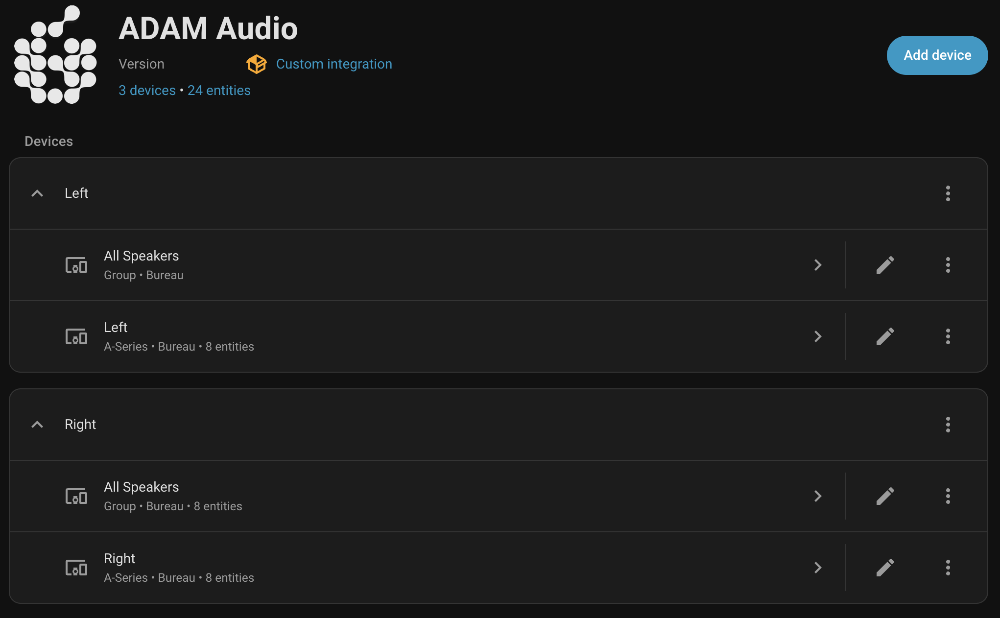
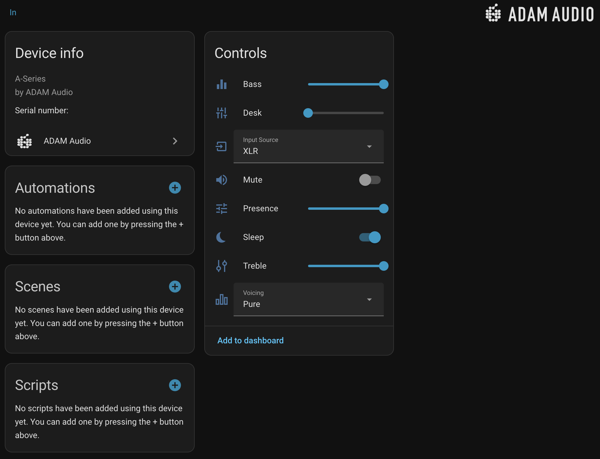
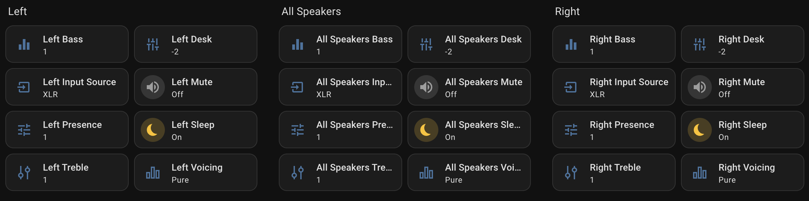
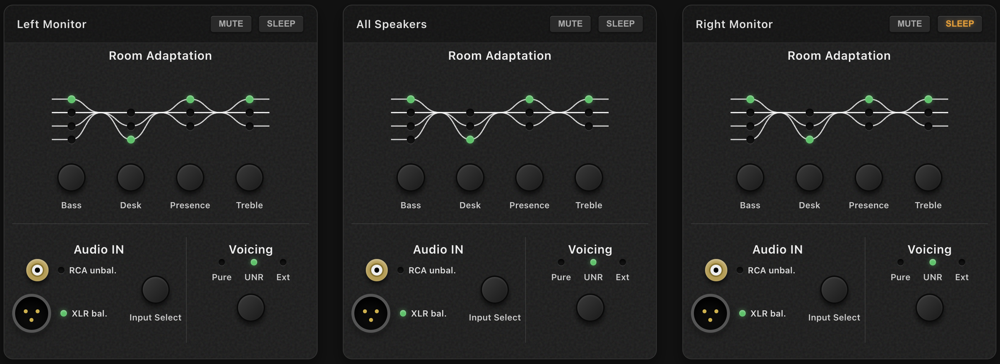

# Home Assistant - ADAM Audio Control (A series)

[](https://hacs.xyz)
[](https://www.home-assistant.io)
[](https://github.com/Perhan35/hass-adam-audio-control/actions/workflows/test.yml)
[](custom_components/adam_audio/manifest.json)
[](https://pypi.org/project/pyadamaudiocontroller/)
[](https://analytics.home-assistant.io/)

Home Assistant integration for **ADAM Audio A-Series studio monitors** (A4V, A7V, etc.) via the AES70/OCA protocol over UDP.

Controls each speaker individually and provides a virtual **All Speakers** group device to control both monitors simultaneously from a single entity or dashboard card.

---

## Features

| Control | Entity Type | Notes |
|---|---|---|
| Mute / Unmute | `switch` | |
| Sleep / Wake | `switch` | Standby mode |
| Input Source | `select` | RCA or XLR |
| Voicing | `select` | Pure, UNR, Ext |
| Bass | `number` | −2 to +1 dB |
| Desk | `number` | −2 to 0 dB |
| Presence | `number` | −1 to +1 dB |
| Treble | `number` | −1 to +1 dB |

Auto-discovery via **mDNS** (`_oca._udp.local.`) with **manual IP fallback**.

---

## Screenshots


*Integration page showing 3 devices (Left, Right, All Speakers) and 24 entities*


*Per-device control panel — EQ, input source, voicing, mute and sleep*


*All entities for Left, All Speakers and Right monitors in the HA dashboard*


*Dashboard cards using the Backplate Card (`adam-audio-backplate-card`)*

<!-- 
*Alternative dashboard cards using the Backplate Card Alternative (`adam-audio-backplate-card-alt`)* -->


*Dashboard cards using the Adam Audio Card (`adam-audio-card`)*

> More alternative dashboard cards will be added soon.

---

## Requirements

- Home Assistant **2026.3.0** or newer
- ADAM Audio A-Series speaker on the **same local network** as your HA instance
- [HACS](https://hacs.xyz) (for the HACS install path)

---

## Installation

### Option A — HACS auto (recommended)

[](https://my.home-assistant.io/redirect/hacs_repository/?owner=Perhan35&repository=hass-adam-audio-control&category=integration)

1. Open HACS → **Integrations**
2. Search for **ADAM Audio Control**
3. Click **Download**
4. Restart Home Assistant

### Option B — HACS manual

1. Open HACS → **Integrations** → ⋮ → **Custom repositories**
2. Add `https://github.com/Perhan35/hass-adam-audio-control` as type **Integration**
3. Search for **ADAM Audio**, click **Download**
4. Restart Home Assistant

### Option C — Fully manual

1. Copy the `custom_components/adam_audio/` folder into your HA config directory:
   ```
   config/
   └── custom_components/
       └── adam_audio/    ← copy here
   ```
2. Restart Home Assistant

---

## Adding the integration

### Auto-discovery (recommended)

If your speakers are on the same network, HA will automatically detect them via mDNS:

1. Go to **Settings → Devices & Services**
2. A notification banner should appear: *"New device discovered: ADAM Audio"*
3. Click **Configure** and confirm each speaker

### Manual entry

1. **Settings → Devices & Services → + Add Integration**
2. Search for **ADAM Audio**
3. Enter the speaker's **IP address** (assign a static DHCP lease to each speaker in your router for reliability)
4. Leave default port at `49494` unless you know it differs
5. Repeat for each speaker

---

## Dashboard Cards

Some custom Lovelace cards are included. They are automatically registered as frontend resources when the integration loads — no manual resource setup needed.

### Add a card

Edit your dashboard and at the bottom the custom Adam Audio cards will display. Select the one you want to add.
Or add a **Manual card** with the following YAML (replace entity IDs with your own — find them in **Settings → Devices & Services → your speaker**).

All cards use the **same configuration schema**, so you can switch between them by changing the `type` field.

### Cards available

- `custom:adam-audio-card`
- `custom:adam-audio-backplate-card`
- `custom:adam-audio-backplate-card-alt` (coming soon)

### ADAM Audio Card (`custom:adam-audio-card`)

A modern UI-style control card with segment selectors, sliders, and status indicators.

```yaml
type: custom:adam-audio-card
title: Left Monitor
entities:
  mute:     switch.{entity_name}_mute
  sleep:    switch.{entity_name}_sleep
  input:    select.{entity_name}_input_source
  voicing:  select.{entity_name}_voicing
  bass:     number.{entity_name}_bass
  desk:     number.{entity_name}_desk
  presence: number.{entity_name}_presence
  treble:   number.{entity_name}_treble
```

### ADAM Audio Backplate Card (`custom:adam-audio-backplate-card`)

A card that visually replicates the physical backplate of an ADAM Audio A-Series monitor — dark metallic panel, green LED indicators, frequency response curves, XLR/RCA connector graphics, and round hardware-style buttons.

- **Room Adaptation**: SVG EQ curves visualize the frequency bands. Green LEDs indicate the current dB value for each band. Click the round hardware buttons below each band (Bass, Desk, Presence, Treble) to cycle through values.
- **Audio IN**: XLR and RCA connector graphics with green LED indicators showing the active input. Click the "Input Select" hardware button to toggle between RCA and XLR.
- **Voicing**: Green LEDs for Pure, UNR, and Ext. Click the "Voicing" button to cycle through voicing modes.
- **Mute / Sleep**: Header buttons that highlight red (mute) or amber (sleep) when active.

```yaml
type: custom:adam-audio-backplate-card
title: Left Monitor
entities:
  mute:     switch.left_mute
  sleep:    switch.left_sleep
  input:    select.left_input_source
  voicing:  select.left_voicing
  bass:     number.left_bass
  desk:     number.left_desk
  presence: number.left_presence
  treble:   number.left_treble
```

### All Speakers Group (exemple with Backplate Card Alternative)

All cards work with the **All Speakers** group entities (prefixed `all_speakers_`):

```yaml
type: custom:adam-audio-backplate-card-alt
title: All Monitors
entities:
  mute:     switch.all_speakers_mute
  sleep:    switch.all_speakers_sleep
  input:    select.all_speakers_input_source
  voicing:  select.all_speakers_voicing
  bass:     number.all_speakers_bass
  desk:     number.all_speakers_desk
  presence: number.all_speakers_presence
  treble:   number.all_speakers_treble
```

> **Finding your entity IDs:** Go to **Settings → Devices & Services → ADAM Audio → your device**, then click on any entity to see its full ID.

---

## Automations examples

```yaml
# Mute both speakers when Sonos starts playing
automation:
  trigger:
    - platform: state
      entity_id: media_player.sonos
      to: playing
  action:
    - service: switch.turn_on
      target:
        entity_id: switch.all_speakers_mute

# Wake speakers at 9:00 AM on weekdays
automation:
  trigger:
    - platform: time
      at: "09:00:00"
  condition:
    - condition: time
      weekday: [mon, tue, wed, thu, fri]
  action:
    - service: switch.turn_off
      target:
        entity_id: switch.all_speakers_sleep
```

---

## Protocol Library

The AES70/OCA protocol layer is published as a standalone Python package:

```
pip install pyadamaudiocontroller
```

This library (`lib/pyadamaudiocontroller/`) handles all low-level UDP communication with the speakers and has zero dependencies beyond the Python standard library. It is used by both the HACS custom component and the HA Core integration.

---

## How it works

Communication uses the **AES70/OCA protocol over UDP** — the same protocol used by ADAM Audio's official *A Control* app. No audio data is sent over the network; this integration is control-only.

State is tracked **optimistically**: the integration records what it has set and assumes the speaker accepted it. There is no read-back for most parameters in the OCA implementation the speakers expose. This means if you change settings via the physical knob or the A Control app, HA won't know until you restart or reload the integration.

A **keepalive** is sent every 25 seconds to maintain the OCA session.

---

## Troubleshooting

> **Warning:** Avoid opening the official **ADAM Audio A Control** app while this integration is running. Although you can open it, doing so will cause the speakers to reset their active commands to the ones sent by A Control, overriding any state set by this integration.

| Symptom | Fix |
|---|---|
| Speaker not discovered | Check the speaker is on the same network/VLAN as HA. Try the manual IP method. |
| Entities show Unavailable | Speaker may be in deep sleep mode. Try the manual IP fallback; the integration retries on the next poll cycle. |
| State doesn't reflect knob changes | Expected — state is optimistic and takes some time to update. Reload the integration entry to reset to defaults (if wanted/needed). |
| Commands stop working | Unload and reload the integration entry to reset the OCA session. |
| A Control app overrode my settings | Opening the A Control app resets commands to those sent by A Control. Close A Control to regain control from Home Assistant. |

---

## Development & Testing

See [CONTRIBUTING.md](CONTRIBUTING.md) for more information.

---

## Repository Structure

This is a **monorepo** that produces three deliverables:

| Directory | Purpose |
|-----------|---------|
| `lib/pyadamaudiocontroller/` | Standalone PyPI protocol library |
| `custom_components/adam_audio/` | HACS custom integration (includes dashboard cards) |
| `scripts/gen_core.py` | Generates files for HA Core PR submission |

More info, see [CONTRIBUTING.md#repository-structure](CONTRIBUTING.md#repository-structure).

---

## TODO

- [x] **Add translation support**
- [x] **Full test suite**: Add tests for all entity platforms, group entity logic, and coordinator update cycle.
- [x] **Fix auto-discovery**: zeroconf auto-discovery doesn't seem to work all the time
- [x] **Add support for more ADAM Audio speaker models**: tested with A4V only
- [x] **Propose this integration to HACS**
- [x] **Extract protocol library to PyPI** (`pyadamaudiocontroller`)
- [ ] **Propose this integration to Home Assistant Core**: ongoing
- [x] **Enhance connectivity and error handling**:
  - [x] add retry logic,
  - [x] implement a proper keepalive mechanism,
  - [ ] better error messages

---

## Credits

Protocol implementation based on **[pacontrol](https://github.com/dmach/pacontrol)** by [@dmach](https://github.com/dmach), licensed GPL-3.0.

---

## License

MIT — see [LICENSE](LICENSE)
